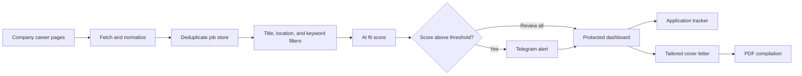

<div align="center">

# 🎯 JobFinder

### A personal job-search system that keeps looking while you focus on applying

**Discover roles, rank the best matches, receive alerts, track decisions, and create
tailored cover letters from one private workflow.**


</div>


---

## 👋 What Is JobFinder?

Searching for work is rarely difficult because there are no vacancies. It is difficult
because the useful ones are scattered across company websites, appear at different
times, and disappear into browser tabs before a decision is made.

JobFinder turns that fragmented process into a small personal operating system:

1. 🔎 It checks selected company career pages on a schedule
2. 🧹 It cleans and deduplicates vacancies into one consistent feed
3. 🧠 It compares promising roles with a resume and assigns a fit score
4. 📲 It sends Telegram alerts when a role clears the chosen threshold
5. 🗂️ It provides a protected dashboard for review and application tracking
6. ✍️ It creates tailored cover letters and compiles them into downloadable PDFs

The result is less time repeatedly searching and more time making deliberate
applications.

---

## ✨ The Experience

### Wake up to a shortlist, not fifty tabs

JobFinder watches configured employers every eight hours. Each source uses the simplest
reliable integration available, such as a public careers API or server-rendered HTML.

### Let cheap filters do the first pass

Roles move through title, location, and keyword filters before an LLM is called. This
keeps the matching stage focused and avoids spending model requests on obviously
irrelevant jobs.

### Keep every decision visible

The dashboard separates strong unreviewed matches from the full job tracker. A role can
move through `new`, `reviewing`, `applied`, `interview`, `offer`, `rejected`, or
`skipped` without losing its original vacancy details or match explanation.

### Turn a good match into an application

Approved roles can produce a resume-grounded cover letter. The draft is stored in
Postgres and can be compiled into a PDF through a GitHub Actions workflow.

---

## 🖥️ Product Areas

| Area | What it helps you do |
|---|---|
| 📥 **Inbox** | Start with unreviewed roles scoring above the match threshold |
| 📊 **Dashboard** | See pipeline health, opportunity volume, and application momentum |
| 🗃️ **Tracker** | Filter every discovered role and update its application status |
| 📄 **Job detail** | Review the vacancy, match score, rationale, and next actions together |
| ✍️ **Cover Letters** | Revisit generated drafts and download compiled PDFs |
| 🔔 **Telegram** | Hear about strong matches and unhealthy job sources without opening the app |

---

## 🔄 How It Works



### Current integrations

- Booking.com
- TNO
- Just Eat Takeaway.com
- Adyen
- ABN AMRO
- ING
- Albert Heijn

Sources that require browser automation are deliberately skipped until a stable,
non-browser integration is available.

---

## 📌 Current Snapshot

The committed data snapshot changes automatically as the scheduled workflow runs. At
the time of this documentation update it contained:

| Signal | Value |
|---|---:|
| Open jobs in the shared feed | **31** |
| Companies represented | **6** |
| Roles with completed AI scoring | **17** |
| Roles above the configured alert threshold | **5** |
| Scheduled discovery frequency | **Every 8 hours** |

These values describe a changing personal feed, not benchmark results.

---

## 🧩 System Design

JobFinder intentionally uses different tools for different responsibilities:

| Layer | Responsibility |
|---|---|
| 🐍 **Python + uv** | Source adapters, normalization, matching, and notifications |
| ⚡ **Next.js + React** | Protected dashboard and owner workflows |
| 🐘 **Postgres** | Application state, resume content, cover letters, and PDFs |
| ⚙️ **GitHub Actions** | Scheduled discovery and on-demand PDF compilation |
| ☁️ **Vercel** | Dashboard hosting |
| 🤖 **DeepSeek** | Resume-to-role fit assessment after deterministic filtering |
| 📲 **Telegram** | High-match and source-health notifications |

The repository-backed job feed keeps discovery output inspectable, while dashboard-owned
state lives in Postgres so the deployed application can update it safely.

---

## 🚀 Run It Locally

<details>
<summary><strong>1. Install both application environments</strong></summary>

```bash
uv sync
pnpm install --frozen-lockfile
```

</details>

<details>
<summary><strong>2. Configure private services</strong></summary>

Create a local `.env` with only the services you intend to use:

```bash
DEEPSEEK_API_KEY=...
TELEGRAM_BOT_TOKEN=...
TELEGRAM_CHAT_ID=...
VIEWER_ACCESS_CODE=...
OWNER_ACCESS_CODE=...
DATABASE_URL=...
```

The scraper itself can run without the AI, Telegram, or dashboard credentials.

</details>

<details>
<summary><strong>3. Refresh and score jobs</strong></summary>

```bash
uv run python fetch_jobs.py
uv run python match_jobs.py
uv run python notify.py --dry-run
```

Useful focused commands:

```bash
uv run python fetch_jobs.py --company adyen
uv run python fetch_jobs.py --force
uv run python match_jobs.py --rescore-all
```

</details>

<details>
<summary><strong>4. Open the dashboard</strong></summary>

```bash
pnpm dev
```

Visit `http://localhost:3000`.

</details>

---

## 🗺️ Repository Guide

```text
jobfinder/
├── app/                 Next.js pages and server routes
├── components/          dashboard views and interaction components
├── config/              companies, sources, matching rules, and prompts
├── data/                normalized jobs and local workflow artifacts
├── lib/                 authentication, dashboard data, Postgres, and cover letters
├── scrapers/            reusable and company-specific source adapters
├── tests/               Python pipeline tests
├── dashboard-tests/     dashboard and API route tests
├── fetch_jobs.py        scheduled discovery entry point
├── match_jobs.py        staged resume-matching entry point
└── notify.py            Telegram and source-health notification entry point
```

To add another employer, follow
[`docs/company_source_onboarding.md`](docs/company_source_onboarding.md).

## 🧭 Design Principles

- **Direct sources first:** prefer public APIs and stable HTML over browser automation.
- **Cheap checks first:** reserve LLM scoring for roles that survive deterministic filters.
- **Explain the score:** store the rationale alongside the number.
- **One alert per opportunity:** persist alert metadata to avoid repeated notifications.
- **Human decisions remain final:** JobFinder prioritizes roles; it does not apply
  automatically.
- **Operational visibility matters:** source-health tracking warns when a careers feed
  quietly stops returning jobs.

---

## ⚠️ Practical Notes

- Career sites change, so individual source adapters may require maintenance.
- AI scores are prioritization aids, not objective hiring predictions.
- The checked-in job feed is refreshed by automation and will change over time.
- Generated cover letters should always be reviewed before they are submitted.
- This is a personal workflow rather than a multi-user recruiting platform.

---

<div align="center">

### 💼 Stop searching everywhere. Start deciding from one place.

</div>
